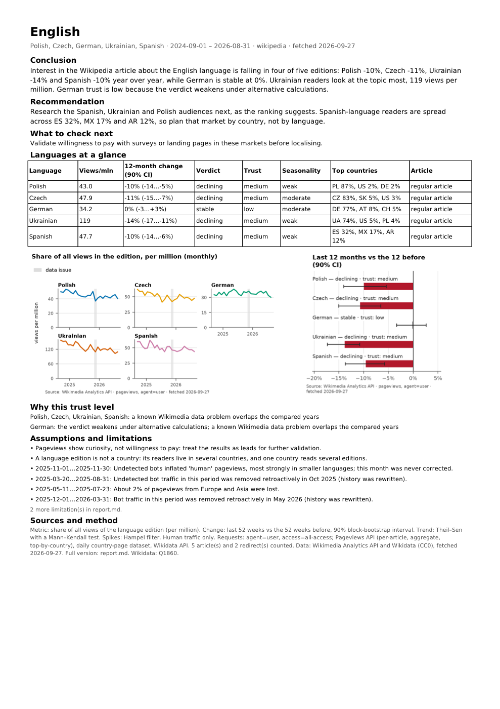

# wiki-interest-research

An Agent Skill that measures public interest in a topic across Wikipedia language editions from Wikimedia
pageviews, says how far the result can be trusted, and builds a one-page PDF report. It is written for
founders deciding which topic to build and which language market to research next, and it works with cheap
models: the `wir` tool does all data work and prints ready sentences, the agent routes and relays.

Questions it answers:
- "Compare the growth of interest in intermittent fasting on Polish and Czech Wikipedia over the last two years."
- "We are thinking of adding an astronomy course. Is interest growing on Ukrainian Wikipedia, and how far can we trust it?"
- "Compare interest in learning English in pl, cs, de, uk, es and prepare a short report: which audiences should we research next?"

## Example
[](examples/english-learning.pdf)

One-page reports from real runs (data through 2026-09-26): [intermittent fasting, Polish and Czech](examples/fasting-pl-cs.pdf) ·
[astronomy, Ukrainian](examples/astronomy-uk.pdf) ([Ukrainian UI](examples/astronomy-uk.uk.pdf)) ·
[English language in five editions](examples/english-learning.pdf) · [a news spike: Liam Payne](examples/spike-liam-payne.pdf).
How they were produced: [examples/README.md](examples/README.md).

## What you get beyond a pageview chart
Measured on 2026-09-27 over 2024-09 – 2026-08; details and the method behind each in [DESIGN.md](DESIGN.md).
- **Renamed articles keep their history.** English "X (social network)" was renamed from "Twitter" in
  February 2026: the current title alone shows +2429% a year, "growing"; with the old title merged the tool
  reports −3.5%, "stable". Counted redirects and their coverage are printed.
- **A fair comparison across languages.** Everything is a share of the edition's views (per million), because
  whole editions shrink at different speeds (Ukrainian −25% in a year, German −7%). German "Englische Sprache"
  is −7% "declining" in raw views but 0% "stable" as a share.
- **Where the readers live.** A language is not a country: 69% of Spanish Wikipedia's views come from outside
  Spain (Mexico 16%, Argentina 12%); reader countries are shown per edition, spike countries per event.
- **Is there anything to read in that language?** Missing, short and featured articles are flagged: Polish
  Wikipedia has no article on intermittent fasting — a content gap, not zero interest.
- **Honest uncertainty.** The 90% interval of the yearly change respects week-to-week correlation: for Polish
  "Astronomia" a naive week-by-week bootstrap would say "declining", the tool says "no clear change".
- **A robustness check you can run.** `wir verify` recomputes each verdict four other ways. For Liam Payne,
  whose death on 2024-10-17 drives 42–52% of the views, it weakens (English) or reverses (Polish) the verdict;
  for Ukrainian astronomy it holds.
- **Known Wikimedia data problems flagged.** A calendar of bot and data-loss incidents dates every affected
  month in the caveats; the November 2025 bot month shows up as +221% in Italian "Astronomia".
- **Trust you can read.** High / medium / low per language, with the reasons in plain words.
- **No invented numbers.** The PDF is refused if the written conclusion contains a number that is not in the
  data: "the topic lost 35% more than the edition" (a re-computed −60 − (−25)) is rejected with the closest
  real values.
- **Built for small models.** The tool computes and writes the sentences; the model routes, asks the user and
  relays. Tested with Claude Haiku 4.5.
- Wikipedia, Wiktionary and Wikivoyage; answers in English or Ukrainian labels.

## Requirements
- [uv](https://docs.astral.sh/uv/) — it downloads Python 3.12 and the locked dependencies on first run.
- Internet access to `wikimedia.org`, `wikidata.org` and `analytics.wikimedia.org`.
- Optional: `WIR_CONTACT` — your e-mail or project URL, sent in the User-Agent as Wikimedia's API policy
  asks. Without it the tool sends this skill's repository URL.

## Install
```bash
./install.sh --project /path/to/your/project   # or: ./install.sh --user
```
The installer symlinks the skill into `.claude/skills/` (Claude Code, OpenCode) and `.agents/skills/` (Codex,
Gemini CLI, OpenCode and other clients), then installs the dependencies. Use `--agents claude` or
`--agents agents` to pick one. Running it again is safe.

## Quick start
Ask your agent one of the questions above. Under the hood it runs (outputs abbreviated from a real run):

```text
$ wir scope "intermittent fasting" --langs pl,cs --ui en          # exit 2: the user must decide
{"state":"input_required","say":["Topic: intermittent fasting (Q1666254) · wikipedia · 2 language(s) · …",
 "Polish: no article on this topic.","Czech: article “Přerušovaný půst”."],
 "ask":{"question":"Polish wikipedia has no article on “intermittent fasting”. What should be done?",
  "options":[{"label":"Continue without Polish","cmd":"wir scope --drop-lang pl"},
             {"label":"Głodówka lecznicza — …","cmd":"wir scope --set pl='Głodówka lecznicza'"}, …]}}

$ wir scope --drop-lang pl                                        # the option the user chose
{"state":"ready", …, "next":[{"why":"Fetch pageviews and compute trends","cmd":"wir analyze"}]}

$ wir analyze
{"state":"ready","say":["Czech: 3.04 views per million; year over year -48% (90% CI -62…-28%) — declining; trust: low.",
 "Czech — why this trust level: few views (under 300 a month), percentages are noisy; …", …],
 "facts":{"cs":{"share_per_m":"3.04","growth":"-48%","growth_ci":"-62…-28%","verdict":"declining","trust":"low", …}},
 "caveats":["Pageviews show curiosity, not willingness to pay: …", …],
 "files":{"data":"…/analysis.json","notes_template":"…/notes.template.md","charts":"…/charts"}}

$ wir verify
{"state":"ready","say":[…,"Czech: robustness check — the verdict holds; trust is now low.", …]}

$ cp …/notes.template.md …/notes.md   # the agent writes a short conclusion using only numbers from the data
$ wir publish
{"state":"ready","files":{"pdf":"…/report.pdf","md":"…/report.md"}}
```

Follow-up questions ("add Slovak", "over 5 years", "growth matters most to us") reuse the project and the
cache. `wir status` shows where a project stands.

## Outputs
Each project lives in `./wiki-interest-output/<date>-<topic>/`:
- `analysis.json` — every number, verdict and trust reason; `series_daily.csv`, `series_monthly.csv`.
- `charts/` — share per million, growth index, yearly change with intervals, reader countries, seasonality.
- `report.pdf` — one A4 page: conclusion, table, charts, limitations, sources.
- `report.md` — the full report with every article, redirect, caveat and the method.

## How it works
```
wir scope    topic ─► Wikidata item ─► article per language (asks the user when unsure) ─► project
wir analyze  views of articles, redirects, old titles and whole editions ─► share per million ─► yearly
             change, trend, spikes, seasonality ─► incidents, trust, countries, supply, ranking
wir verify   four alternative calculations ─► holds / weakens / reverses
wir publish  checked notes ─► one-page PDF + full Markdown report
```
Key decisions (each with its reason, the common alternative, evidence and tests in [DESIGN.md](DESIGN.md)):
- [Topic resolution through Wikidata; the tool asks, never guesses](DESIGN.md#31-topic-resolution)
- [Renames and redirects counted](DESIGN.md#32-a-topic-is-its-articles-redirects-and-old-titles)
- [Share per million, not raw views](DESIGN.md#34-share-per-million-not-raw-views)
- [Yearly change with a block-bootstrap interval](DESIGN.md#35-yearly-change-g-with-an-honest-interval)
- [Trust from explicit rules with reasons](DESIGN.md#310-trust-from-explicit-rules-with-reasons)
- [A robustness check](DESIGN.md#311-a-robustness-check-the-user-can-run)
- [An interface built for small models](DESIGN.md#315-an-interface-built-for-small-models)
- [Reports that cannot contain invented numbers](DESIGN.md#316-reports-that-cannot-contain-invented-numbers)

Formulas and thresholds: [references/methodology.md](references/methodology.md).

## How it was verified
- **Tests:** `uv run pytest` — unit tests and end-to-end runs replayed from recorded real Wikimedia responses
  (offline); `uv run pytest -m live` for a few real calls; `uvx --from skills-ref agentskills validate
  <path to this folder>` for the skill format.
- **Statistics test-first** on synthetic series with known answers (a doubling, a planted trend, a spike next
  to a small bump, a pure seasonal wave).
- **An independent review of every part** against the specification, with the real commands run; every
  must-fix was fixed and re-reviewed.
- **Real runs of the example questions** at every stage, and every chart and PDF looked at.
- **Dry-runs on Claude Haiku 4.5:** the cheap model followed SKILL.md on the example questions; where it went
  wrong (invented next steps and trust reasons, a skipped robustness check, scores quoted from the full report)
  the tool output or SKILL.md was fixed and the run repeated.
- What these checks caught: [DESIGN.md](DESIGN.md#5-how-the-design-was-checked--what-the-checks-caught);
  details: [DEVELOPMENT.md](DEVELOPMENT.md).

## Developing it further
How it evolves: every failure, in an evaluation run or from a user, becomes a new evaluation scenario; the fix
goes into the tool first (a check, a sentence, a question with ready commands) and into SKILL.md last; the
scenario is re-run on the small model, tracking the pass rate, tool calls and cost.

Directions, in the order in which they unblock the next kind of question:
1. **Signal quality** — a bot heuristic from the mobile/desktop split, merge detection, a control basket of
   similar articles, change-point detection: false growth or decline is the costliest error
   (`providers/wikimedia.py`, `series.py`, `stats.py`, `trust.py`).
2. **Wider topics** — automatic baskets from Wikidata relations and categories, word lists from Wiktionary
   translation tables: umbrella topics and language apps now need manual `--add-article` (`scope.py`).
3. **Markets** — per-country trends of tracked articles from the daily country dataset, normalisation by
   speakers and internet users: questions about countries, not languages (`geo.py`, `rank.py`).
4. **Larger data volumes** — batch mode from Wikimedia's dump files into a local columnar store instead of
   per-article API calls, resumable jobs, topic portfolios with scheduled re-runs and alerts on a changed
   verdict, cache pruning (`providers/`, `cache.py`, `pipeline.py`).
5. **More sources and environments** — self-hosted MediaWiki (60 days of pageviews) and supply-only signals
   where no pageviews exist, an offline pack for sandboxes without network, an optional MCP wrapper
   (`providers/`, `cli.py`).
6. **More scripts in the PDF** — CJK, Arabic, Devanagari fonts; such notes now need an English report
   (`publish/pdf.py`).

## Limitations
Pageviews show curiosity, not willingness to pay; a language is not a country; bots and data backfills
distort some months. The full list: [references/limitations.md](references/limitations.md).

## Privacy
The tool reads only public Wikimedia data and sends no user data anywhere. Requests carry a User-Agent with
`WIR_CONTACT` (or the repository URL). Responses are cached locally (`WIR_CACHE_DIR`, by default the OS
cache folder).

## License
MIT, see [LICENSE](LICENSE). Pageview data: Wikimedia Foundation, CC0; Wikidata: CC0. The PDF embeds DejaVu Sans,
which ships with matplotlib under the DejaVu fonts license (free to use and embed).
